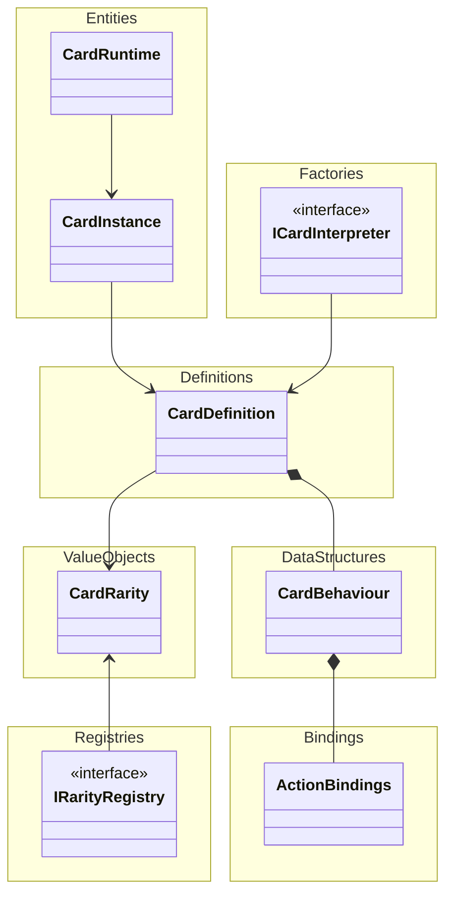

## 🎯 Purpose
This architecture is designed to build a highly extensible and maintainable card engine,
focused on:

- Separation of Logic and Data: Cards are defined as immutable data, while runtime behavior is separate.
- Functional Reactive Programming (FRP) Principles:
Changes are triggered by explicit events, not by random mutable states.
- Declarative World Modeling:
Cards describe "what happens," and the system reacts in a deterministic way.

The goal is to make it easy to:

- ✅ Load cards from YAML.
- ✅ Support flexible upgrades/debuffs without chaos.
- ✅ Clearly isolate behavior, presentation, and battle state.

## 🧱 Architecture Overview

Cards are structured into three layers:

|Layer|Purpose|Lifetime|
|---|---|---|
|CardDefinition|Immutable design data (e.g., rarity, cost, initial properties)|Forever|
|CardInstance|Game run–specific instance, affected by upgrades/debuffs|One rogue-like run|
|CardRuntime|Battle-only runtime instance, affected by temporary effects|One battle|

### 🔗 Property System

Each card layer maintains its own set of properties via:

```csharp
Dictionary<string, int> Properties
```

Property Lookup Order:

```
CardRuntime ➔ CardInstance ➔ CardDefinition
```
- If a property exists in CardRuntime, it takes precedence.
- If not, fallback to CardInstance, then CardDefinition.

Thus, no manual merging or cascading logic is needed during runtime.

This allows the system to load and resolve cards purely declaratively.

## 🧠 Design Philosophy

- Immutable Core: No random state mutation allowed. All changes are done through explicit flows.
- Separation of Concerns:
Properties handle static values; Behaviors handle dynamic flows.
- Functional Reactive Mindset:
  - Properties and behaviors react to explicit events.
  - No direct mutation, no hidden side effects.
- Declarative Loading:
Cards are purely data. The engine interprets them into live objects at runtime.

## 🛠 Usage Guide

- [Modder Guide-Adding Card](/Documents/ModderGuide/Card.md)