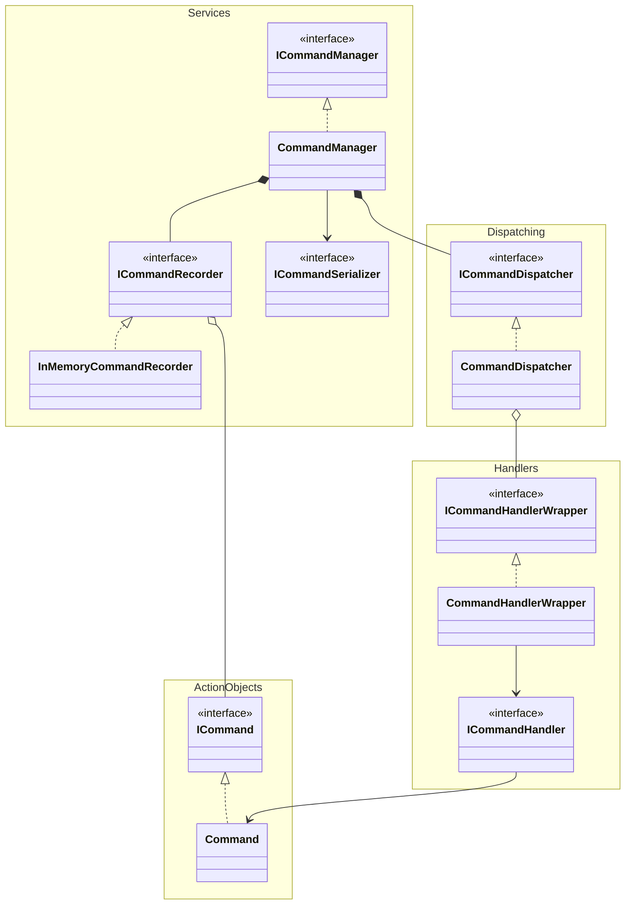

## 🎯 Purpose

This module provides a formalized way to describe and execute game logic operations via explicit Command classes.

By separating commands from their execution and persistence logic, this framework achieves:
- Declarative control of game actions
- Testability and traceability of gameplay
- The ability to record and replay game sessions

While it does not support Undo, the system is designed with an Event Sourcing–like philosophy, making it suitable for deterministic replays and advanced debugging tools.

## 🧱 Architecture Overview

This module defines a clean and extensible architecture for executing game commands in a structured and traceable way.

### Components and Responsibilities

- **Command**  
  Represents a game action request. It contains only the data required to perform the operation, but not the logic.

- **Command Handler**  
  Contains the logic to execute a specific command. Each handler implements `ICommandHandler<TCommand>` and is responsible for one command type.

- **Command Dispatcher**  
  Maintains a registry of command handlers. When a command is dispatched, it resolves the appropriate handler and delegates the execution.

- **Command Manager**  
  Acts as a facade to execute and manage commands. It receives a command, delegates execution to the dispatcher, and coordinates recording and serialization.

- **Command Recorder**  
  Records each executed command. This allows for deterministic replay or logging purposes. (Note: Undo is not supported, but the system is replay-friendly.)

- **Command Serializer**  
  Serializes and deserializes command objects for persistence, logging, or transmission.

### Flow of Execution

1. A command is created with the required data.
2. The command is passed to the **Command Manager**.
3. The manager forwards the command to the **Command Dispatcher**.
4. The dispatcher looks up the appropriate **Command Handler** and executes it.
5. The command is saved by the **Recorder**, and optionally serialized by the **Serializer**.

This separation of concerns makes the system testable, traceable, and future-proof for features like replay and state inspection.

## 🛠 Usage Guide

To create a new command, do **not** implement `ICommand` directly.  
Instead, inherit from `Command<TCommand>` to take advantage of the built-in dispatch, validation, and serialization logic.

### ✅ Recommended

```csharp
public sealed class UseCardCommand : Command<UseCardCommand>
{
    public override string CommandName => "HogeHoge::UseCard";

    public PlayerId PlayerId {get;}
    public CardId CardId { get; }

    public UseCardCommand(PlayerId playerId, CardId cardId)
    {
        PlayerId = playerId;
        CardId = cardId;
    }
}
```

This pattern uses self-referencing generic constraints to ensure that the correct type is passed to the dispatcher.

### ❌ Do not do this:

```csharp
// Not recommended: manual ICommand implementation loses type safety
public sealed class UseCardCommand : ICommand
{
    // Manual implementation required, less safe and error-prone
}
```

Using Command<T> guarantees:
- Automatic casting to the correct command type
- Dispatcher integration
- Validation and serialization with no extra boilerplate