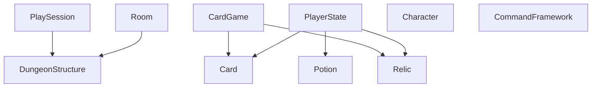

# This page is a work in progress.

## 🎯 Purpose

Why this diagram exists.  
→ "To provide an overview of how domain-level modules depend on each other, ensuring clean separation of concerns and acyclic architecture."

## 🧱 Modules Explained

### Features

### System

- [CommandFramework](./CommandFramework.md)
- [DungeonStructure](./DungeonStructure.md)

## 🔄 Design Principles
