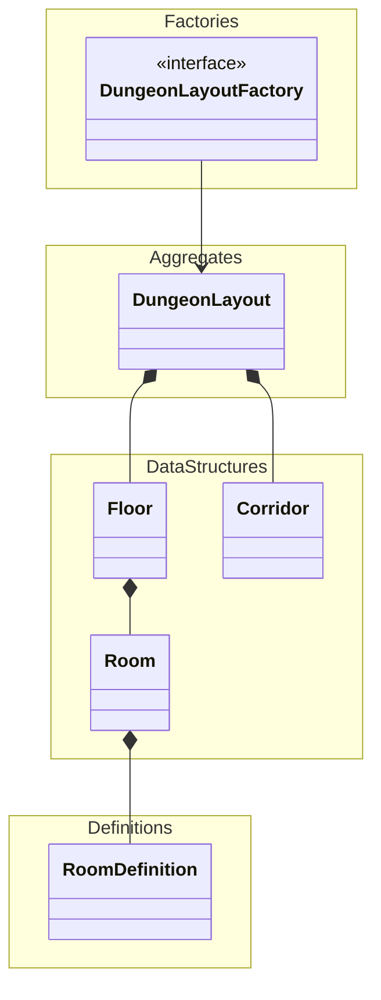

## 🎯 Purpose

This module defines the static structure of a dungeon, including its layout, rooms, floors, and connecting corridors.
It focuses on the relationships and composition of dungeon elements, without including gameplay logic or mutable state.

The structure serves as the foundation for generating gameplay spaces and routing systems.

## 🧱 Architecture Overview

DungeonLayout is generated by a DungeonLayoutFactory and treated as immutable.
Any dynamic or gameplay-related state (e.g., room visited, corridor unlocked) is stored and managed outside this model.

This design separates structural concerns (what the dungeon is) from behavioral or temporal concerns (what the dungeon does or becomes).

Sub-elements such as Floor, Room, and Corridor are composed inside DungeonLayout, reflecting the overall topology.

Each Room is linked to a RoomDefinition, which describes its intended contents (e.g., combat, shop, rest, etc.), but does not itself contain logic.